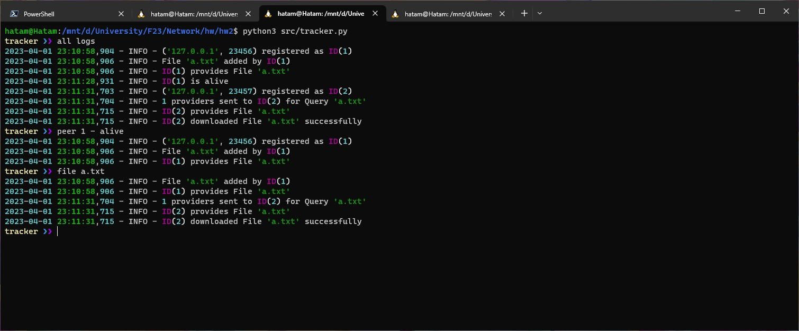
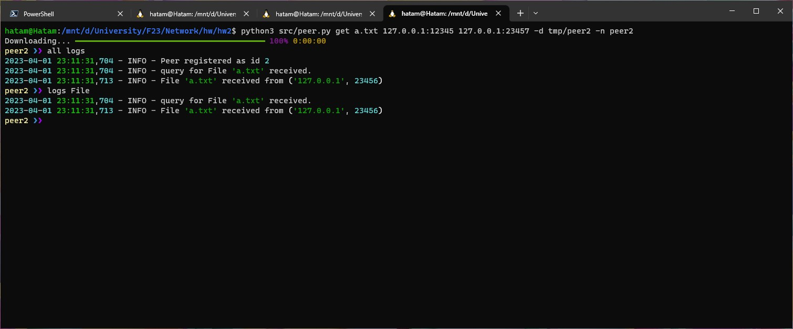

# How to run

First of all requirements need to be installed:

```bash
$ pip install -r requirements.txt
```

Then we can run the tracker (There only can be one tracker):

```bash
$ python3 src/tracker.py 127.0.0.1:12345
```

To simulate three different peers, we need to provide three unique name for
peers (so log files does not interfere). We also need to create three different
folders to use them as base directory (where peer searches for filename) so
files are separate for each peer. This is preferred folder structure:

```plain
.
├── README
├── conf
│   ├── peer.conf
│   ├── server-logger.conf
│   └── server.conf
├── log
├── requirements.txt
├── src
│   ├── peer.py
│   ├── tracker.py
│   └── util
│       ├── __init__.py
│       ├── common.py
│       ├── console.py
│       ├── decor.py
│       ├── encrypt.py
│       └── torrent.py
└── tmp
    ├── peer1
    ├── peer2
    └── peer3
```

Then we execute peer programs:

```bash
$ python3 src/peer.py share a.txt 127.0.0.1:12345 127.0.0.1:23456 -d tmp/peer1 -n peer1
```

Other peers can be executed in similar ways.

> Both tracker and peer program has a help option you can use with -h

# Console

Consoles can be cleared with `clear` command. Programs can be terminated with
`exit` command. Log commands are explained bellow:

## Tracker

In the tracker we have three type of commands:

- all logs
- peer id [include terms query] [- exclude terms query]
- file (-all | filename)

`all logs` will print all the logs in the system. `peer id` will print all logs
related to `id`. `peer` command can be queried with terms that should be in the
log and terms that shouldn't be in the log. for example `peer 2 - alive` will
prints all logs related to peer with id 2 and hides logs that contain word
`alive`. `file -all` will print all logs with `File` word in them and
`file filename` will filter `file -all` results with `filename`.



## Peer

In the peer we have two type of commands:

- all logs
- logs [include terms query] [- exclude terms query]

`all logs` will print all the logs in the system and `logs` will print them
according to the query provided:


